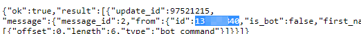
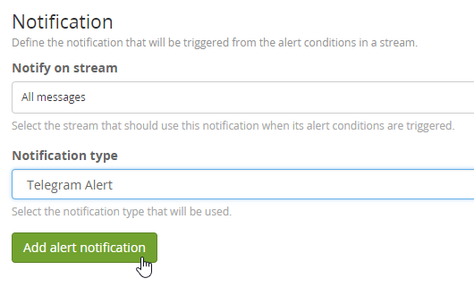
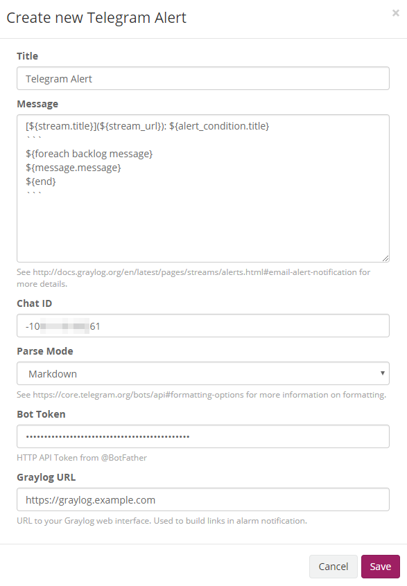

# Telegram Alert

[](https://github.com/irgendwr/TelegramAlert/releases)
[](https://travis-ci.org/irgendwr/TelegramAlert)

TelegramAlert allows you to send [Graylog](https://www.graylog.org) alert messages to a specified [Telegram](https://telegram.org) chat.

## Requirements

Requires Graylog 2.0 or later.

## Installation

[Download the plugin](https://github.com/irgendwr/TelegramAlert/releases/latest)
and place the `.jar` file in your plugins folder that is configured in your `graylog.conf`
as described in the [Graylog documentation](http://docs.graylog.org/en/latest/pages/plugins.html#installing-and-loading-plugins).

Restart graylog-server: `service graylog-server restart`

## Usage

### Step 1

Create a new bot with the [BotFather](https://t.me/BotFather).

### Step 2

Send the Bot a message and go to `https://api.telegram.org/bot<BOT_TOKEN>/getUpdates`
(replace `<BOT_TOKEN>` with the token you got from BotFather) to get your ID, as shown below.



### Step 3

Add a new alert notification in your Graylog-interface and select `Telegram Alert` as the notification type.

The message is a template that can be configured as described in the [Graylog Documentation](http://docs.graylog.org/en/latest/pages/streams/alerts.html#email-alert-notification)




## Build

This project is using [Maven](https://maven.apache.org) and requires Java 8 or higher.

You can build the plugin using the following command:

```bash
mvn package
```

The plugin file `telegram-alert-x.x.x.jar` will be saved in the `target` directory

## Plugin Release

Versions are released using the [maven release plugin](https://maven.apache.org/maven-release/maven-release-plugin/):

```bash
mvn release:prepare
mvn release:perform
```

TravisCI builds and uploads the release artifacts automatically.